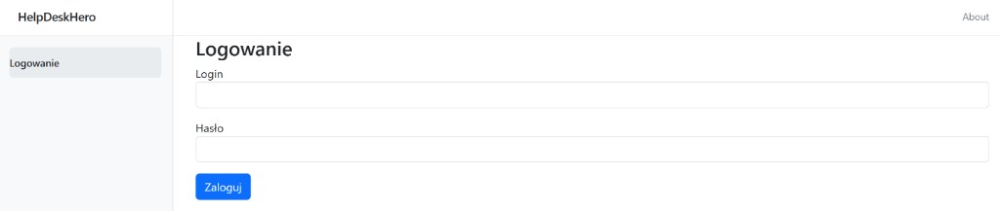
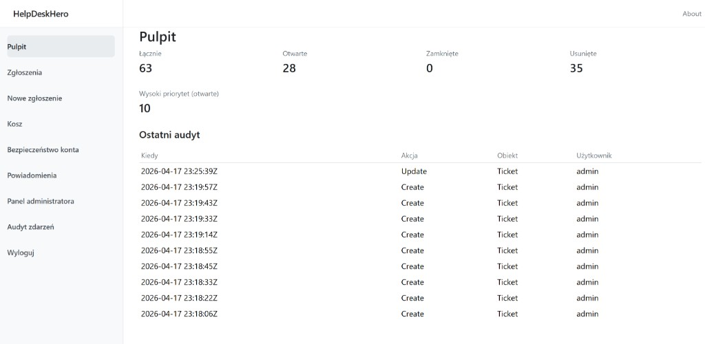
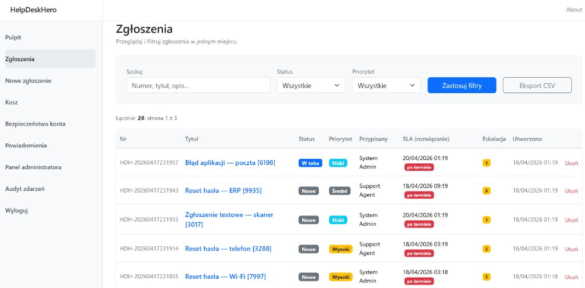
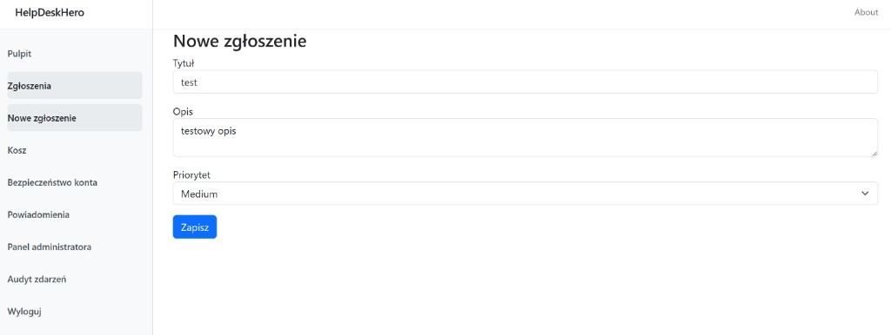
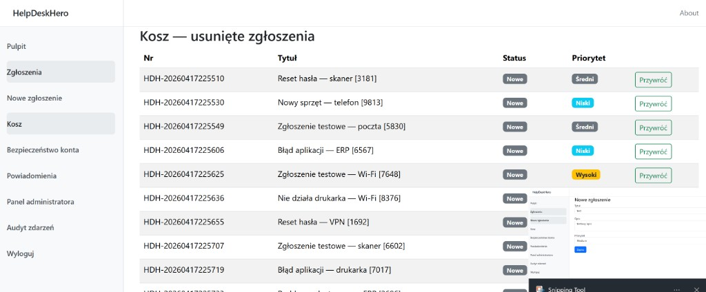
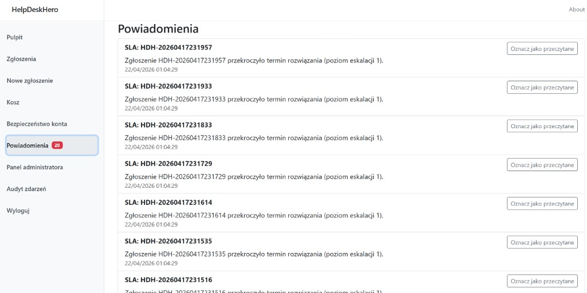
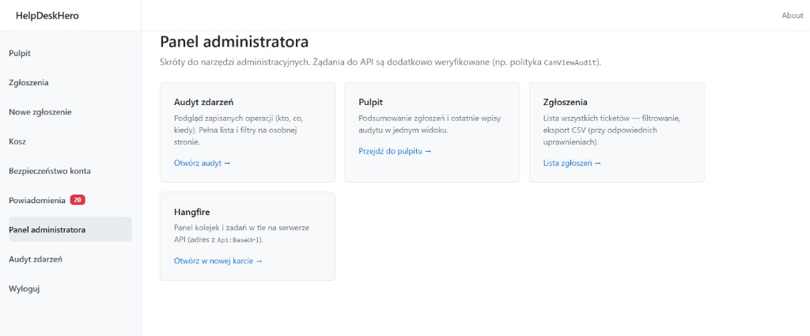
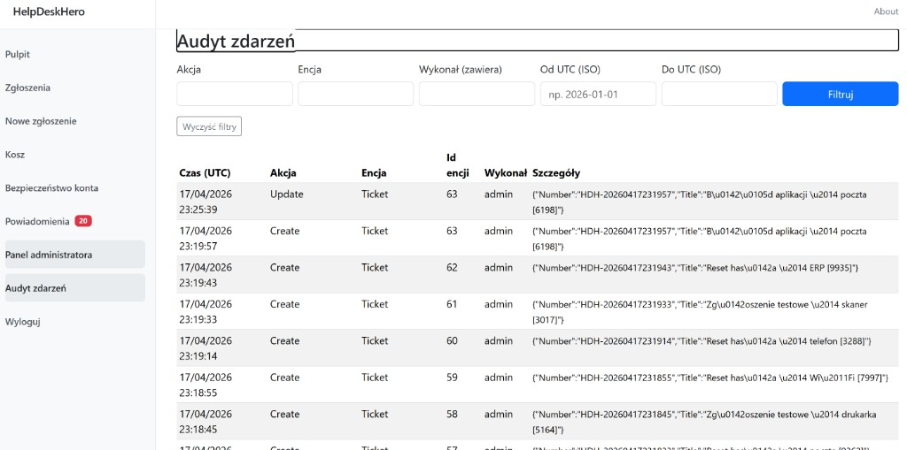
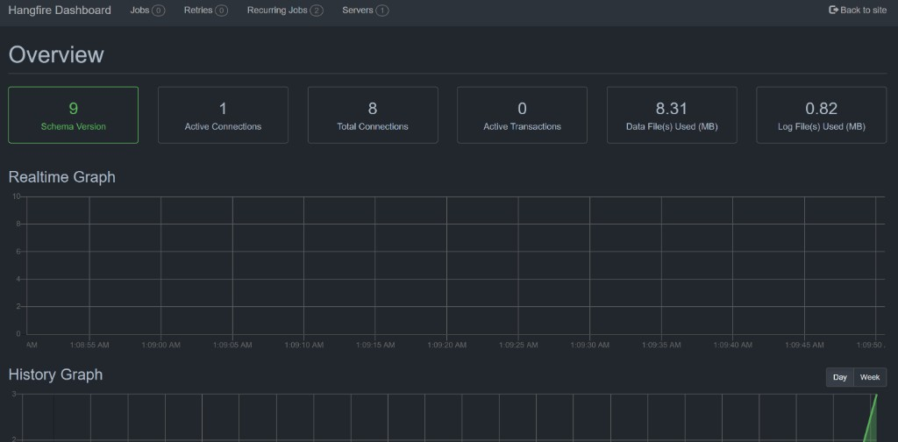

# HelpDeskHero

System helpdesk w przeglądarce: zgłoszenia (tickety), role (Admin / Agent / User), JWT, REST API, frontend **Blazor WebAssembly**, baza **SQL Server**, w tle **Hangfire** (zadania cykliczne), **SignalR** (live updates), **SLA** (terminy, auto-przypisanie, eskalacja) oraz wzorzec **Outbox** dla niezawodnych powiadomień.

---

## Wnioski

Wykonano **7 z 8 tutoriali**. Kolejka (RabbitMQ) została wystawiona jako **osobny serwis** (`tools/HelpDeskHero.TicketQueueWorker`) — główna aplikacja helpdesk działa niezależnie i nie wymaga jej do działania.

- C# + .NET w porównaniu do Java + Spring Boot wydaje się prostszy w modularyzacji aplikacji.
- .NET jest bardziej zamkniętym ekosystemem; Spring Boot daje większą dowolność w doborze narzędzi.
- Visual Studio jest mało czytelne — szybko przeszedłem na **JetBrains Rider**.
- Projekt mógłby zostać podzielony na mikroserwisy — wydzielenie serwisu użytkowników pozwoliłoby na łatwiejszą migrację do dojrzalszych rozwiązań (np. Keycloak) i zapobiegałoby zabrudzeniu encji `User` logiką biznesową.
- Bardzo czytelna definicja kontrolerów w ASP.NET Core i ich parametryzacja przez atrybuty.

---

## Stos technologiczny

| Warstwa | Technologia |
|---|---|
| Runtime | .NET 10 |
| API | ASP.NET Core Web API, Swagger |
| ORM | Entity Framework Core + SQL Server |
| Auth | ASP.NET Core Identity + JWT (Bearer) + Refresh Token |
| Realtime | SignalR — hub `/hubs/tickets` |
| Kolejka zadań | Hangfire + SQL Server, dashboard `/hangfire` |
| Frontend | Blazor WebAssembly |
| Testy API | xUnit + WebApplicationFactory + EF InMemory |
| Testy UI | bUnit |
| Infrastruktura | Docker Compose (SQL Server + API + UI/nginx) |

---

## Struktura repozytorium

```
PIE/
├── src/
│   ├── HelpDeskHero.Shared/     # Wspólne DTO i kontrakty (auth, tickety, paginacja…)
│   ├── HelpDeskHero.Api/        # Backend: ASP.NET Core, EF Core, Identity, Hangfire, SignalR
│   └── HelpDeskHero.UI/         # Frontend: Blazor WASM, klient SignalR
├── tests/
│   ├── HelpDeskHero.Api.IntegrationTests/
│   └── HelpDeskHero.UI.Tests/
├── tools/
│   ├── HelpDeskHero.TicketLoadGenerator/   # Generator obciążenia (RabbitMQ)
│   └── HelpDeskHero.TicketQueueWorker/     # Worker kolejki (RabbitMQ)
├── docker/                      # Dockerfile dla API i UI (nginx)
├── docker-compose.yml
└── .env.example                 # Przykładowe zmienne środowiskowe
```

---

## Uruchomienie — Docker (zalecane)

```bash
docker compose up --build
```

| Usługa | Adres |
|---|---|
| UI | http://localhost:8888 |
| API + Swagger | http://localhost:5000/swagger |
| Hangfire | http://localhost:5000/hangfire |
| SQL Server | localhost:1433 |

**Opcjonalnie — RabbitMQ** (wymagany tylko przez narzędzia z `tools/`):

```bash
docker compose --profile tools up -d rabbitmq
```

### Konfiguracja środowiska

Skopiuj `.env.example` → `.env` i dostosuj wartości:

```bash
cp .env.example .env
```

Kluczowe zmienne: `JWT_KEY`, `SQL_SA_PASSWORD`, `API_PUBLIC_URL` (adres API widoczny z przeglądarki).

---

## Uruchomienie lokalne (bez Dockera)

**Wymagania:** .NET SDK 10.x, SQL Server (LocalDB lub pełna instancja)

```bash
# 1. Uruchom API (migracje i seed wykonają się automatycznie przy starcie)
dotnet run --project src/HelpDeskHero.Api/HelpDeskHero.Api.csproj

# 2. Uruchom UI
dotnet run --project src/HelpDeskHero.UI/HelpDeskHero.UI.csproj
```

Domyślne porty: API `https://localhost:5001`, UI `https://localhost:7045`.  
Adres API dla UI ustawiasz w `src/HelpDeskHero.UI/wwwroot/appsettings.json` → `Api:BaseUrl`.

---

## Konta testowe (seed)

| Login | Hasło | Rola |
|---|---|---|
| `admin` | `Admin1234` | Admin, Agent |
| `agent` | `Agent1234` | Agent |
| `user` | `User1234` | User |

---

## Główne funkcje

### Zgłoszenia (tickety)
- CRUD z paginacją, filtrami i eksportem CSV
- Soft delete, kosz i przywracanie
- Audit log zdarzeń (kto, co, kiedy)

### SLA i przypisanie
- Automatyczne wyliczenie `DueFirstResponseAtUtc` / `DueResolveAtUtc` wg priorytetu przy tworzeniu ticketu
- Auto-przypisanie do agenta z najmniejszą liczbą aktywnych zgłoszeń
- Przeliczenie SLA przy zmianie priorytetu

### Outbox + SignalR
- Zapis do `OutboxMessages` w tej samej transakcji co zmiana ticketu
- `OutboxProcessorService` (co ~5 s) wysyła zdarzenia `TicketChanged` do hubów SignalR
- Klient Blazor subskrybuje grupy `dashboard` i `ticket:{id}` — odświeżanie bez F5

### Eskalacja SLA (Hangfire)
- Recurring job `sla-monitor` co 5 minut
- Warunek: ticket aktywny, `DueResolveAtUtc` przekroczony, cooldown ~1 h
- Skutek: wyższy `EscalationLevel`, wpis eskalacji, powiadomienia in-app

### Powiadomienia
- Kanały: in-app (baza `UserNotifications`), e-mail, webhook
- Licznik nieprzeczytanych w menu, odświeżany przez SignalR

### Załączniki
- `LocalFileStorage` + konfiguracja `FileStorage:RootPath` (w Dockerze — wolumen)

---

## Testy

```bash
dotnet test tests/HelpDeskHero.Api.IntegrationTests/HelpDeskHero.Api.IntegrationTests.csproj
dotnet test tests/HelpDeskHero.UI.Tests/HelpDeskHero.UI.Tests.csproj
```

---

## Migracje EF Core

```bash
dotnet ef migrations add NazwaMigracji \
  --project src/HelpDeskHero.Api/HelpDeskHero.Api.csproj \
  --startup-project src/HelpDeskHero.Api/HelpDeskHero.Api.csproj
```

Migracje są aplikowane automatycznie przy starcie API (poza środowiskiem `Testing`).

---

## Certyfikat deweloperski HTTPS

Jeśli przeglądarka zgłasza błąd certyfikatu przy uruchomieniu lokalnym:

```bash
dotnet dev-certs https --clean
dotnet dev-certs https --trust
```

---

## Screeny z aplikacji

**Logowanie**


**Pulpit**


**Lista zgłoszeń**


**Nowe zgłoszenie**


**Kosz — usunięte zgłoszenia**


**Powiadomienia SLA**


**Panel administratora**


**Audyt zdarzeń**


**Hangfire Dashboard**

